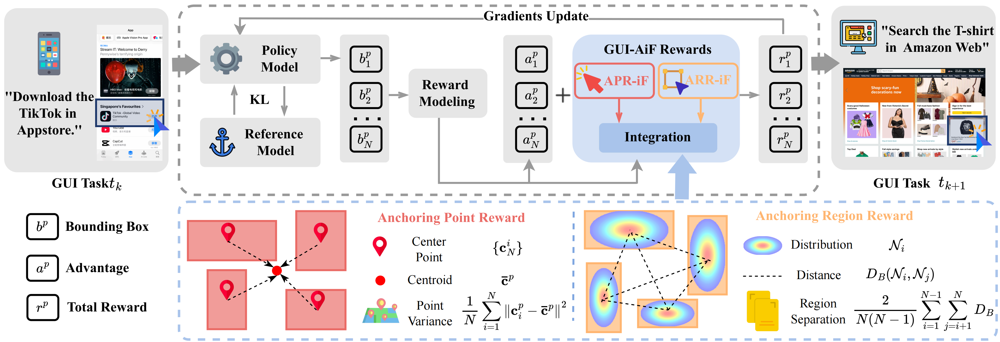
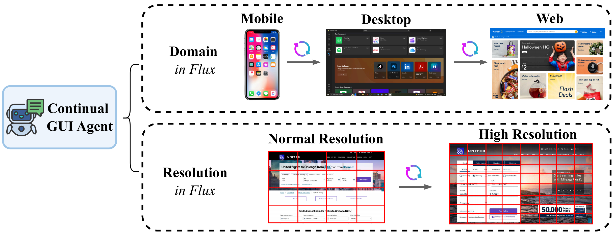

<h1 align="center">Continual GUI Agents</h1>

<p align="center">
  <em>A continual framework for GUI agents in UI environment flux</em>
</p>

<p align="center">
  <a href="https://arxiv.org/abs/2601.20732"></a>
  <a href="https://github.com/xavierliu34/GUI-AiF"></a>
</p>

<hr>

<p align="center">
  
</p>

<p align="center">
  <em>GUI-AiF advances the RFT paradigm by shaping grounding rewards: APR-iF encourages diverse interaction points, while ARR-iF refines element regions. Together, GUI-AiF enables agents to better adapt to varying interaction locations and element scales.</em>
</p>

## Motivation

<p align="center">
  
</p>

Continual GUI Agents operate under evolving scenarios: domain-in-flux (e.g., from Mobile OS to Web OS) and resolution-in-flux (e.g., scaling from 1080p to 4K).

## Installation

```bash
conda create -n gui-aif python=3.12
conda activate gui-aif
bash setup.sh
```

then install the dependencies:

```bash
pip install deepspeed==0.15.4
pip install filelock
pip install qwen_vl_utils
```

## Start

Train GUI-AiF on your own data:

```bash
cd gui-aif
bash run_grpo.sh
```

You should configure:

* `DATA_PATH` : Path to your dataset YAML config, where sequentially set the GUI dataset required to train
* `CKPT_PATH` : Model checkpoint path
* `LOG_DIR` , `SAVE_PATH` : Output folders

Training data should follow the JSONL format demonstrated in:

```text
example_training_json.json
```
